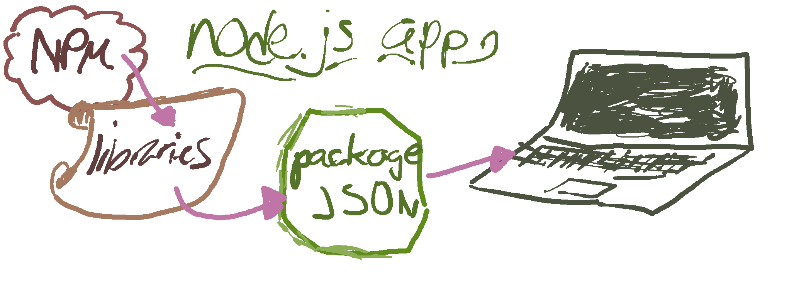

## Intro to Node


## Introduction to Node
<h3>Getting Started</h3>



### 1. `package.json`

We're going to create a `package.json` file for our new application. This contains information about your app, such as:
- Application's name
- Author
- Git(hub) repository
- Current version
- License
And in the future, it will also save any dependancies your application may have.

#### Let's Give it a Try

- To get started, create a new project folder. **Change directory** to that folder.
- Next, create an empty Javascript file to host our application: `touch app.js`
- Then, enter the following command:


- That's right: `npm init`

You'll be prompted through a variety of questions, such as:

```bash
name: an_api
version: (1.0.0) 0.1.0
description: My first express api
entry point: (index.js) app.js
test command:
git repository: https://github.com/code-for-coffee/express_api
keywords:
author: your-user-name
license: (ISC) MIT
```

This generates the following `package.json` file:
```json
{
  "name": "Tasker",
  "version": "0.1.0",
  "description": "The MEAN way to track your Tasks!",
  "main": "app.js",
  "scripts": {
    "test": "echo \"Error: no test specified\" && exit 1"
  },
  "repository": {
    "type": "git",
    "url": "https://github.com/code-for-coffee/Tasker"
  },
  "author": "code-for-coffee",
  "license": "MIT",
  "bugs": {
    "url": "https://github.com/code-for-coffee/Tasker/issues"
  },
  "homepage": "https://github.com/code-for-coffee/Tasker"
}
```

### 2. Setting Application dependancies

Use `npm install <pkg> --save` afterwards to install a package and save it as a dependency in the package.json file. Once you run this command, a dependency object will be created inside of your `package.json`. Go ahead - take a look! It looks like this, right?
```json
"dependencies": {
  "express": "^4.12.4"
}
```

*All* node package files are saved to `node_modules` folder. If provided a `package.json` file from another project, you can run the `npm install` command to fetch/install the required packages for that app!
