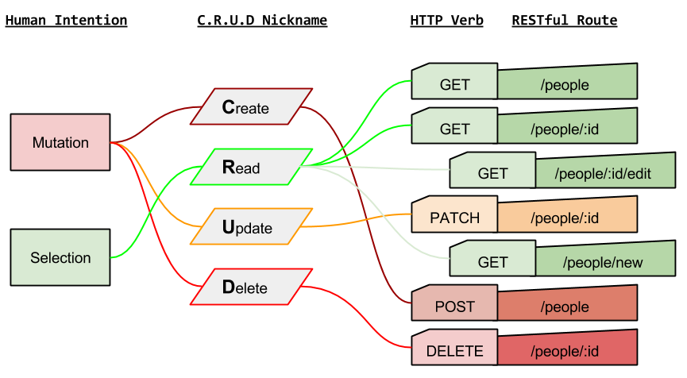

## RESTful API with MongoDB

In `app.js` we need to include additional files and dependencies. We also need to create a `routes/tasks.js` file to include. Go ahead and do that now.




In **app.js**, add the following:
```javascript
// require additional modules
var favicon = require('serve-favicon');
var logger = require('morgan');
var cookieParser = require('cookie-parser');
var bodyParser = require('body-parser');

// require mongodb & model
require('./models/db'); // db
require('./models/Tasks'); // model

// include route files in /routes
var routes = require('./routes/index');
var tasks = require('./routes/tasks');

// start express app
var app = express();

// we need to parse req.body.. so we add parsers
app.use(bodyParser.json());
app.use(bodyParser.urlencoded({ extended: true }));

// view engine setup
app.set('views', path.join(__dirname, 'views'));
app.set('view engine', 'ejs');

// uncomment after placing your favicon in /public
//app.use(favicon(__dirname + '/public/favicon.ico'));
app.use(logger('dev'));
app.use(bodyParser.json());
app.use(bodyParser.urlencoded({ extended: false }));
app.use(cookieParser());
app.use(require('less-middleware')(path.join(__dirname, 'public')));
app.use(express.static(path.join(__dirname, 'public')));

// define our http routes and bind those routes to routes in /routes
app.use('/', routes); // localhost:5000/
app.use('/api/tasks/', tasks); // localhost:500/api/tasks

```

Our **/routes/tasks.js** file will look just like this:

```javascript
var express = require('express');
var router = express.Router();

var favicon = require('serve-favicon');
var logger = require('morgan');
var cookieParser = require('cookie-parser');
var bodyParser = require('body-parser');

var mongoose = require('mongoose');
var Task = require('../models/Tasks');

/* GET /api/tasks listing. */
router.get('/', function(req, res, next) {
  console.log(req.body);
  Task.find(function (err, tasks) {
    if (err) return next(err);
    res.json(tasks);
  });
});

/* POST /api/tasks */
router.post('/', function(req, res, next) {
  console.log(req.body);
  Task.create(req.body, function (err, task) {
    if (err) return next(err);
    res.json(task);
  });
});

/* GET /tasks/id */
// http://localhost:5000/api/tasks/5566a21e1e3a211aa1c63495
router.get('/:id', function(req, res, next) {
  Task.findById(req.params.id, function (err, task) {
    if (err) return next(err);
    res.json(task);
  });
});

/* PUT /tasks/:id */
router.put('/:id', function(req, res, next) {
  console.log(req.body);
  Task.findByIdAndUpdate(req.params.id, req.body, function (err, task) {
    if (err) return next(err);
    res.json(task);
  });
});

/* PATCH /tasks/:id */
router.patch('/:id', function(req, res, next) {
  console.log(req.body);
  Task.findByIdAndUpdate(req.params.id, req.body, function (err, task) {
    if (err) return next(err);
    res.json(task);
  });
});

/* DELETE /tasks/:id */
router.delete('/:id', function(req, res, next) {
  console.log(req.body);
  Task.findByIdAndRemove(req.params.id, req.body, function (err, task) {
    if (err) return next(err);
    res.json(task);
  });
});

module.exports = router;
```
