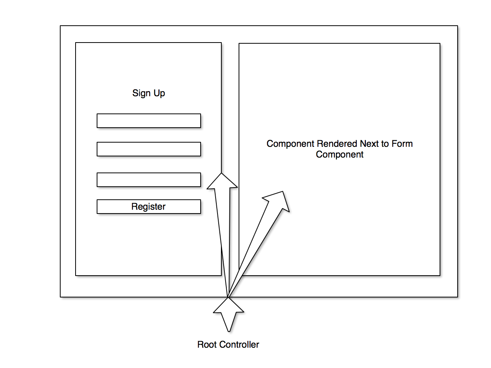

# React.js Overview

> An overview of how to create and understand React.js

## What is React?

React.js is a library developed at Facebook for creating modularized single page applications. A *single page app* (SPA) is an application that's driven completely by AJAX requests rather than traditional page refreshes. Those traditional page refreshes are replaced by JavaScript which swaps in/out markup for the page to render. When you use a single page application, you are only loading a page once and from then on your JavaScript changes what the view looks like.

## What is it useful for?

Imagine being able to create your own custom HTML elements. Imagine that by simply using `<MyElement />` you would get an entire set of HTML markup that carries out a purpose like a form. Now imagine that you can pass data to your custom elements so that they can render in different ways. For example, a generic `<Form />` element could be used as both a signup or a login form depending on the data you pass to it.

## Component Ground Rules

Before we get started creating components there are some *__very important rules__* you should know about.

1. React components are like Russian dolls. You will have a parent component that is responsible for rendering one or more child components within it - sometimes all at once
2. Every React component *must* have __one__ and *only* __one__ root node. That means you cannot create a React components from sibling elements. All elements must have one parent.
3. A React component will always re-render whenever it's state or props change

__Examples of the above rules__

*1 - The Russian Doll Rule*

Your app will look like this:



This rule relates to one-way data binding. React implements one-way data binding. In a React application, data can only travel one way: from parent components to children. There is a way to pass data up the chain to parent elements which we'll talk about later.

*2 - Only 1 Root Node*

When you render your components...

__This is good:__

```html
<div>
  One single root node. Okay!
</div>
```

__This is bad:__

```html
<div>
  My first set of content...
</div>
<div>
  A second, sibling element. Oh no! We need a root element to hold us!
</div>
```

## Creating a basic React component

A React component is a piece of a view that gets rendered every time the state of your application changes or the beginning of the application itself. A basic React component will have a `render` method and a `getInitialState` method. At the very least every one will have a `render` method. This method is what outputs HTML to the page. Let's create a Hello World React component:

__IMPORTANT! WARNING!__

The way we're creating these components **are not** how you would create them in a production environment. We're building this the quick and easy way. In a real world scenario you would use Browserify and other tools to concatenate, require, and convert your React and JSX files into a form that your browser can understand without the extra help of the libraries we're loading here. We will get into the Right Way later this week.

```html
<!DOCTYPE html>
<html>
<head>
  <title>My React App</title>
</head>
<body>

<div id="form-component"></div>

<script src="https://cdnjs.cloudflare.com/ajax/libs/react/15.2.1/react.js"></script>
<script src="https://cdnjs.cloudflare.com/ajax/libs/react/15.2.1/react-dom.js"></script>
<script src="https://cdnjs.cloudflare.com/ajax/libs/babel-core/5.8.34/browser.min.js"></script>
<script src="https://cdnjs.cloudflare.com/ajax/libs/jquery/2.2.0/jquery.min.js"></script>

<!-- Your react app here -->
<script type="text/babel">
var Page = React.createClass({
  render: function() {
    return (
      <div className="container">
        Hello World!
      </div>
    );
  }
});

ReactDOM.render(<Page />, document.getElementById('form-component'));
</script>
</body>
</html>
```

This is a basic React component rendered on a page. The variable `Page` holds a React class that renders a div with a class of `container` and has text within it saying "Hello World!". The very last line of the file calls on the `ReactDOM` library to replace the div loaded on the page with an ID of `form-component` with the output of the `Page` component's `render` method.

This is a very simple example.

From here on out we're going to focus only on the JavaScript and leave out the surrounding HTML tags so we can focus on the important parts. Please be aware though, that the React JavaScript we're showing here exists within the larger context of an HTML page identical to the one shown above.

### Managing State and Props

Every React component has props and state. Props are simply properties that get passed to the components like attributes are passed to HTML elements. They change how the application is displayed.

State is an object that is remembered between re-renderings. State also can change the look of your view but the difference is that each components has its own state and the state of a components is remembered or held in memory until the component is unmounted or the state is updated.

Accessing props is as simple as calling `this.props.propName`.

Accessing state is as simple as calling `this.state.stateProp`.

Here's an example of a component with state passing data to another component:

```js
var Page = React.createClass({
  // this will set the initial state of our Page component
  getInitialState: function() {
    return {
      isLoggedIn: false,
      username: null,
      notice: null
    }
  },
  // This is a custom method we use to register new users
  registerUser: function(username, password) {
    // To update state you must grab a copy of it,
    // update the parts of the copy you want updated,
    // and then replace the state completely:
    var state = this.state;

    if (!password) {
      state.isLoggedIn = false;
      state.notice = 'You must choose a password to register'
    } else {
      state.username = username;
      state.isLoggedIn = true;
      state.notice = 'Welcome back!'
    }

    this.setState(state); // <-- This replaces the current application state
                                 using the data we updated on 'state' earlier
  },
  // render the view
  render: function() {
    return this.state.isLoggedIn ? <Dashboard username={this.state.username} /> : <Register register={this.registerUser} notice={this.state.notice} />
  }
});

var Register = React.createClass({
  getInitialState: function() {
    return {
      username: '',
      password: ''
    }
  }
  registerUser: function() {
    // This method will call the "register" prop which carries with it
    // the "registerUser" method of it's parent component (Page).
    this.props.register(this.state.username, this.state.password);
  },
  // let's pretend there are 2 methods here that correspond to the ones on the form inputs:
  //    1. this.updateUsername - Updates the username in state
  //    2. this.updatePassword - Updates the user's password in state
  render: function() {
    return (
      <div className="row">
        <form>
          <input type="text" name="username" onKeyPress={this.updateUsername} />
          <br />
          <input type="password" name="password" onKeyPress={this.updateUsername} />
          <br />
          <button onClick={this.registerUser}>Register</button>
        </form>
      </div>
    );
  }
});

var Dashboard = React.createClass({
  render: function() {
    return (
      <div>
        <h2>Welcome back {this.props.username}</h2>
        <p>
          More content goes here
        </p>
      </div>
    );
  }
});

// This code renders the entire React appication in place of an empty `div` tag on the page:
ReactDOM.render(<Page />, document.getElementById('form-component'));
```

## Homework

See the [Homework repo](https://github.com/ga-chicago/wdi5-homework/tree/master/week9/01_monday_homework) for tonight's homework. It is basically a repetition of this morning's React challenge except this time you'll be doing it all yourself. You'll be given a basic Express app as the starting point and it's up to you to finish it off with React.js components. More details in the homework repository on GitHub or you can `git pull upstream master` from your own copy of the homework repository.

## More resources

This week will be full of React lessons. Be sure to check out the [official docs](https://facebook.github.io/react/docs/getting-started.html) to learn even more about React.js
